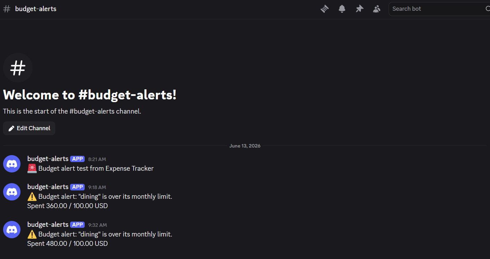
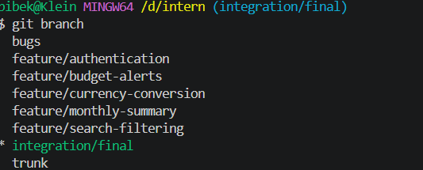
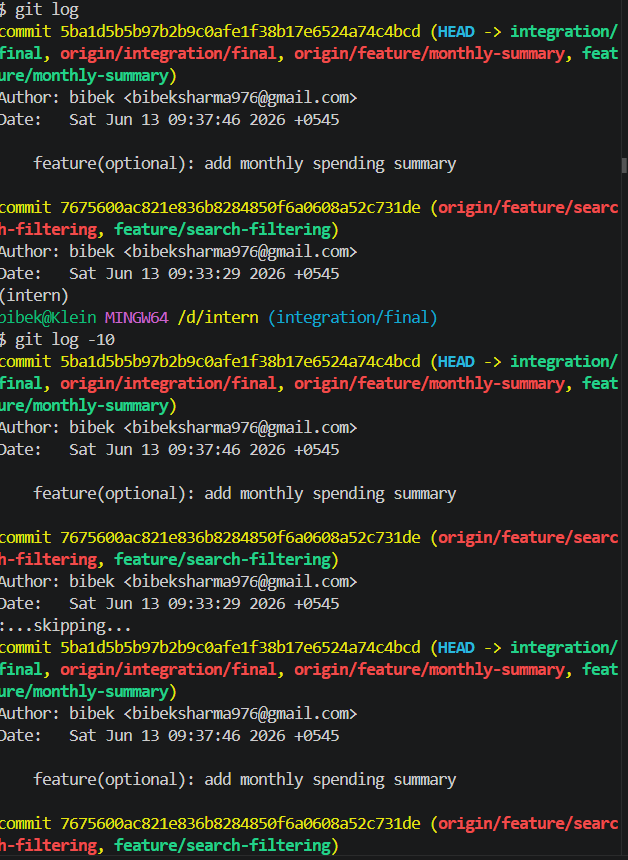

Expense Tracker API
Overview

Expense Tracker API is a Django REST Framework application for managing personal expenses with support for:

User authentication and ownership-based access control
Multi-currency expense tracking
Automatic currency conversion
Monthly budget limits
Discord budget notifications
Expense search and filtering
Monthly spending summaries

The project was developed using a feature-branch workflow and validated through automated tests, Django system checks, API testing, and Discord notification verification.

Technology Stack
Backend
Python 3.12
Django 5.0.6
Django REST Framework 3.15.1
Database
SQLite
External Services
ExchangeRate API
Discord Webhooks
Features Implemented
Required Feature 1: Authentication & User Ownership

Implemented token-based authentication using Django REST Framework.

Features:

Token Authentication
Protected API endpoints
User-specific categories
User-specific expenses
Ownership enforcement

Authentication endpoint:

POST /api/token/

Protected endpoints:

GET /api/categories/
POST /api/categories/

GET /api/expenses/
POST /api/expenses/

GET /api/expenses/<id>/
PUT /api/expenses/<id>/
DELETE /api/expenses/<id>/
Required Feature 2: Currency Conversion

Implemented support for multiple currencies.

Features:

Currency field added to Expense model
ExchangeRate API integration
Automatic conversion to configured base currency
Currency-aware expense summaries

Example:

{
  "title": "Hotel",
  "amount": "120.00",
  "currency": "EUR"
}

Summary:

{
  "base_currency": "USD",
  "categories": [
    {
      "category": "Travel",
      "total": "138.83"
    }
  ]
}
Required Feature 3: Budget Threshold Alerts

Implemented category-level monthly spending limits.

Features:

Monthly limit per category
Automatic monthly spending calculation
Budget threshold validation
Discord notifications when limits are exceeded

Example:

{
  "name": "Dining",
  "monthly_limit": "100.00"
}

Alert:

⚠️ Budget alert: "Dining" is over its monthly limit.
Spent 360.00 / 100.00 USD
Optional Feature 1: Expense Search & Filtering

Implemented expense filtering using query parameters.

Search by title:

GET /api/expenses/?search=dinner

Filter by category:

GET /api/expenses/?category=4

Combined:

GET /api/expenses/?search=dinner&category=4
Optional Feature 2: Monthly Spending Summary

Implemented monthly spending overview endpoint.

GET /api/expenses/monthly-summary/

Example:

{
  "month": "2026-06",
  "base_currency": "USD",
  "total": "637.66"
}
Required Bug Fixes
Bug #1 – Serializer Field Typo

Issue:

"catgory"

Fix:

"category"

Result:

Expense serializer loads correctly.

Bug #2 – Expense Creation Response Typo

Issue:

serialzer.data

Fix:

serializer.data

Result:

Expense creation returns HTTP 201 successfully.

Bug #3 – Incorrect Date Filtering Logic

Issue:

date__gt=start_date

Fix:

date__gte=start_date

Result:

Filtering now includes expenses occurring on the start date.

Bug #4 – Missing Aggregate Import

Issue:

Sum("amount")

without:

from django.db.models import Sum

Fix:

Added missing import.

Result:

Expense summary endpoint executes successfully.

Bug #5 – URL Routing Order Conflict

Issue:

path("expenses/<pk>/", ...)

was evaluated before:

path("expenses/summary/", ...)

Fix:

Reordered routes
Changed:
<pk>

to:

<int:pk>

Result:

Summary endpoint resolves correctly.

Notification Service Design Decision
Initial Approach: Telegram Bot API

Initially, Telegram Bot API was evaluated for budget notifications.

Work completed:

Created bot using BotFather
Generated API token
Tested Telegram API communication

Challenges encountered:

Updates were not received consistently
Notification delivery could not be reliably verified
Additional setup complexity for assignment requirements

Example response:

{
  "ok": true,
  "result": []
}

Although authentication succeeded, notification delivery could not be consistently confirmed.

Final Approach: Discord Webhooks

The notification system was migrated to Discord Webhooks.

Reasons:

Simpler implementation
Easier testing
No bot hosting required
Immediate message delivery
Reliable verification

Implementation:

expenses/services/notifications.py

Example:

⚠️ Budget alert: "dining" is over its monthly limit.
Spent 360.00 / 100.00 USD

Result:

Budget alerts are delivered successfully to a Discord channel whenever spending exceeds the configured limit.

Project Setup
Clone Repository
git clone <repository-url>
cd intern
Create Virtual Environment
python -m venv .venv

Windows:

.venv\Scripts\activate
Install Dependencies
pip install -r requirements.txt

or

uv sync
Configure Environment Variables

Create .env:

EXCHANGE_RATE_API_URL=https://v6.exchangerate-api.com/v6
EXCHANGE_RATE_API_KEY=YOUR_API_KEY

DISCORD_WEBHOOK_URL=YOUR_DISCORD_WEBHOOK

BASE_CURRENCY=USD
Run Migrations
python manage.py migrate
Create Admin User
python manage.py createsuperuser
Start Server
python manage.py runserver
API Endpoints
Authentication
POST /api/token/
Categories
GET /api/categories/
POST /api/categories/
Expenses
GET /api/expenses/
POST /api/expenses/

GET /api/expenses/<id>/
PUT /api/expenses/<id>/
DELETE /api/expenses/<id>/
Reports
GET /api/expenses/summary/
GET /api/expenses/monthly-summary/
Git Workflow

Development followed a feature-branch workflow.

Branches:

trunk
feature/authentication
feature/currency-conversion
feature/budget-alerts
feature/search-filtering
feature/monthly-summary
bugs
integration/final
Final Integration Branch

All completed work was merged into:

integration/final

Merge sequence:

git merge feature/authentication
git merge feature/currency-conversion
git merge feature/budget-alerts
git merge feature/search-filtering
git merge feature/monthly-summary
Testing

Validation performed using:

python manage.py test
python manage.py check

Results:

Ran 3 tests

OK

System check identified no issues.

Additional validation:

Category API testing
Expense creation testing
Currency conversion testing
Monthly summary testing
Search/filter testing
Discord notification testing
## Screenshots

### Discord Budget Alert

### Git Branch Structure

### Git Commit History

Final Submission

Final validated branch:

integration/final

This branch contains:

All required features
All optional features
All 5 required bug fixes
Discord notification integration
Passing automated tests
Successful end-to-end verification

Final verification:

python manage.py test
python manage.py check

Result:

Ran 3 tests

OK

System check identified no issues.